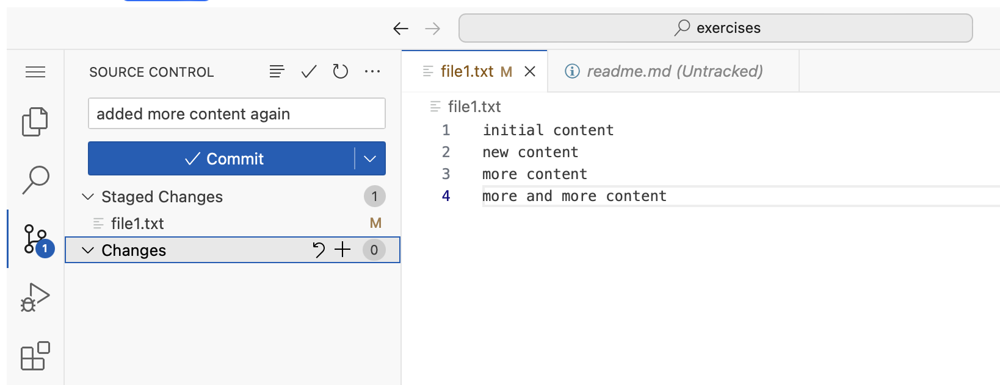
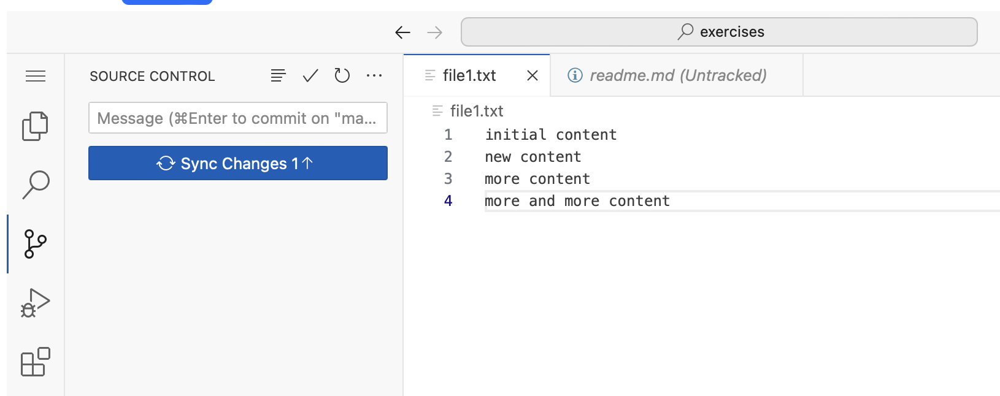
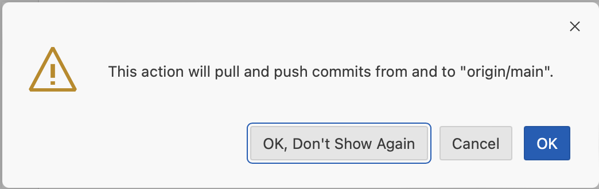

A local git repository is fine. But when you need to work with others, then a remote repository, is needed.

There are many different solutions for this.
The most known ones are probably [Github](www.github.com) and [Gitlab](www.gitlab.com).

In this lab, we have our own Git server, that we can use.

First we will add a remote source, to our repo, by running the following in our teminal
```terminal:execute
prefix: Run
title: Add remote source
command: |
    clear
    git remote add origin http://$GIT_HOST/mygitrepo.git
```

Then we will push our local repository, to the remote repository.
```terminal:execute
prefix: Run
title: Push local repository to remote
command: git push -u -f origin main
```
Note this command forces the changes thru. So it might not be best practice, outside of this lab.

In the CLI we use `git push`, to push the changes, that we have comitted localy, to the remote Git repository.

Switch back to the editor tab, add more changes to `file1.txt`, stage the file, give a comit message and commit (just like we did before)
```editor:open-file
title: Open file1.txt
file: ~/exercises/file1.txt
```



We should now see a `Sync changes 1` box.

This one shows that we have one commit, that is not sync yet. 


Click it, and select `OK, Don't show again` to the warning, that a Sync will both pull and push changes from the remote repository.


If you get the following box, then just say no.


---
**Talk in class**

about why to enable auto fetch, and why not to. 

---