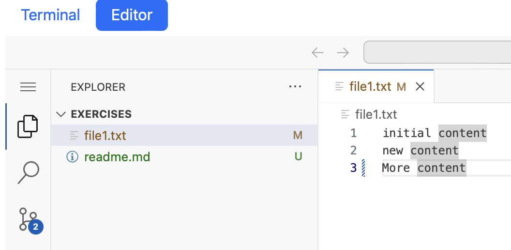
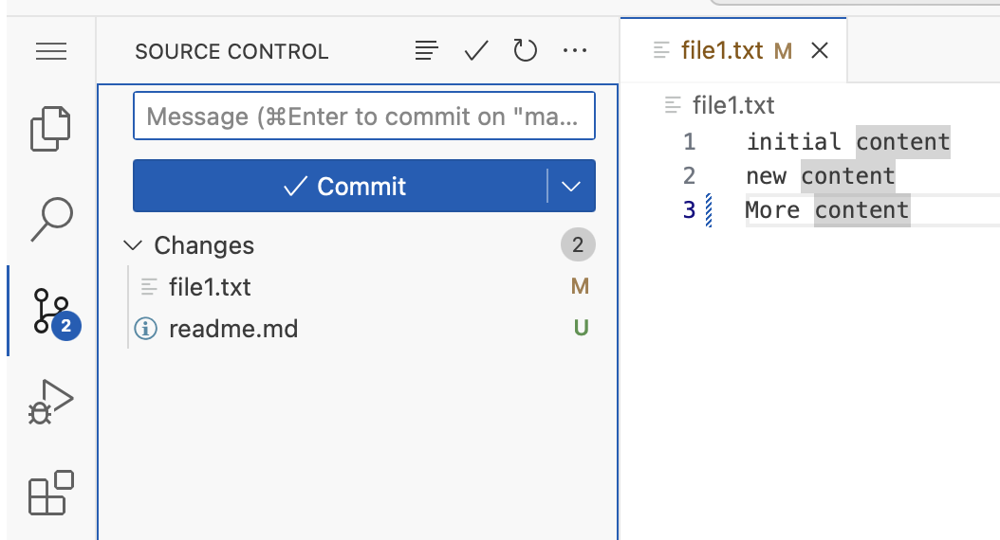
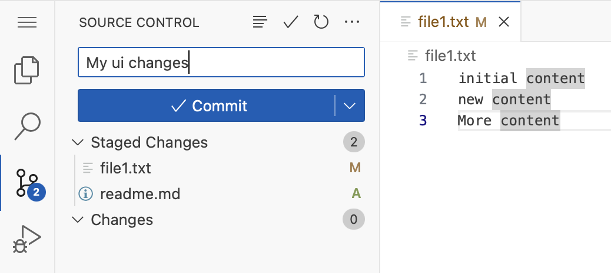

Let's now use the UI, to do the same as before.

Switch to the editor tab.

```
Open file1.txt and add a new line at the bottom.
In our example we wrote "More content"
```


Click on the `source Control`icon (there should be a number next to it)


If the number is 2, that means that there is 2 files with changes in this Git repository.

If you followed the guide, then the 2 files are 
- file1.txt
- readme.md

The readme.md has been there all the time, but was never added to git.

Let's add both files now.

Start by pressing the `+` next to each file
This add's them to staging

Then write a commit message in the box above the commit button.
We have written "my ui changes" as our commit message.




After you click `Commit` the button changes to publish branch.
If this Git repo was part of a remote Git repo, then we could now push our changes to that repo (or create a new repository on that remote server), for all to see, and colaborate.

